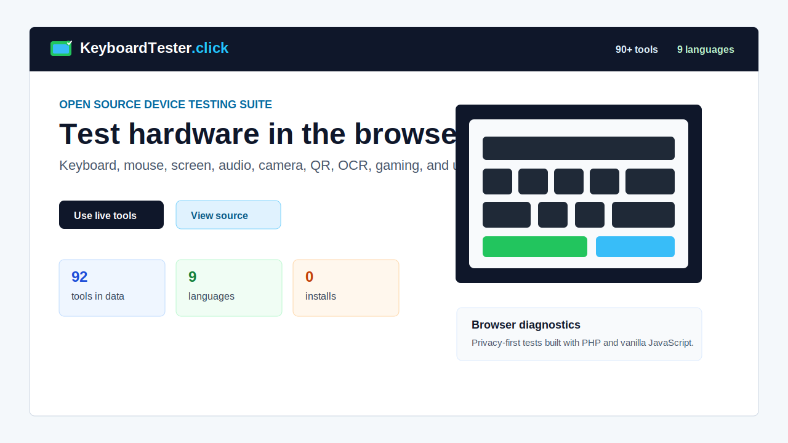

# KeyboardTester.click

Free browser-based hardware testing tools for keyboards, mice, screens, audio,
cameras, gaming input, QR/OCR utilities, and everyday diagnostics.

Everything runs in the browser. No install. No account. No upload needed for
the core device tests.

[Live site](https://keyboardtester.click/) |
[Open project page](https://open.keyboardtester.click/) |
[All tools](https://keyboardtester.click/pages/all-tools.php) |
[GitLab mirror](https://gitlab.com/nasirazizawan/keyboardtester.click)



## Project Snapshot

| Area | Status |
| --- | --- |
| Tools | 90+ browser-based testing and utility tools |
| Languages | 9 language hubs: English, Arabic, French, German, Japanese, Korean, Portuguese, Russian, Spanish |
| Stack | PHP 7.4, vanilla JavaScript, HTML, CSS |
| License | MIT for source code |
| Live domain | `https://keyboardtester.click` |
| Open project page | `https://open.keyboardtester.click` |

## What You Can Test

- Keyboard keys, ghosting, N-key rollover, stuck keys, layouts, latency, and typing speed.
- Mouse buttons, scroll wheel, click speed, DPI, polling rate, drag behavior, and ghost clicks.
- Display issues such as dead pixels, stuck pixels, refresh rate, black/white screen, gradients, and contrast.
- Webcam, microphone, speakers, headphones, stereo channels, and audio response checks.
- Utility tasks such as QR generation, QR scanning from images, OCR, passwords, and WhatsApp links.
- Gaming utilities such as reaction time, controller testing, eDPI, FPS checks, and crosshair tools.

## Most Useful Entry Points

| Tool | Link |
| --- | --- |
| Keyboard Tester | https://keyboardtester.click/tools/keyboard-tester/ |
| All Testing Tools | https://keyboardtester.click/pages/all-tools.php |
| Mouse Tester | https://keyboardtester.click/mouse-test.php |
| Click Speed Test | https://keyboardtester.click/mouse_speed_tester.php |
| Dead Pixel Test | https://keyboardtester.click/dead-pixel-test.php |
| Microphone Test | https://keyboardtester.click/mic-tester.php |
| Webcam Test | https://keyboardtester.click/webcamtesterindex.php |
| Headphone / Speaker Test | https://keyboardtester.click/headphone_speaker_tester_index.php |
| Keyboard Ghosting Test | https://keyboardtester.click/keyboard-ghosting-test.php |
| N-Key Rollover Test | https://keyboardtester.click/n-key-rollover-test.php |
| QR Code Reader | https://keyboardtester.click/qr-code-reader.php |
| OCR Tool | https://keyboardtester.click/ocr-tool.php |

## Why This Exists

Many hardware checks still require installing small utilities or opening pages
that only test one thing. KeyboardTester.click keeps common diagnostics in one
browser-first suite:

- quick tests for non-technical users,
- deeper checks for gaming and repair workflows,
- localized pages for international users,
- privacy-first behavior for mic, camera, keyboard, and mouse tests,
- lightweight PHP/JavaScript code that can be audited and self-hosted.

## Local Development

Requirements:

- PHP 7.4 or newer
- XAMPP, Laragon, MAMP, or another PHP-capable local server
- No database
- No Node build step required for normal development

Run locally:

```bash
git clone https://github.com/nasirazizawan009/keyboardtester-click.git
cd keyboardtester-click
```

Point your local PHP server at the project directory. On this development
machine the usual URL is:

```text
https://localhost/kbt/
```

The site detects localhost versus production through `config.php`.

## Repository Structure

```text
assets/       CSS, JavaScript, images, and shared front-end assets
blog/         Static blog articles and blog index
docs/         GitHub Pages project site for open.keyboardtester.click
help/         Help and guide content for tools
images/       Tool and article imagery
includes/     Shared PHP components, schema, SEO, ads, navigation
languages/    Localized language hubs and tool pages
pages/        Tool directory and category pages
tools/        Tool-specific PHP/JS implementations
```

## Contributing

Useful contributions include:

- bug reports with browser/device details,
- accessibility improvements,
- translations and localization fixes,
- new browser-based diagnostic tools,
- performance and Core Web Vitals improvements,
- clearer documentation for repair or gaming workflows.

Read [CONTRIBUTING.md](CONTRIBUTING.md) before opening a pull request.

## Project Links

| Resource | URL |
| --- | --- |
| Website | https://keyboardtester.click |
| Open project page | https://open.keyboardtester.click |
| GitHub | https://github.com/nasirazizawan009/keyboardtester-click |
| GitLab | https://gitlab.com/nasirazizawan/keyboardtester.click |
| YouTube | https://www.youtube.com/@KeyboardTester-dot-click |
| Facebook | https://www.facebook.com/keyboardtester.click |
| Feedback | https://keyboardtester.click/feedback.php |

## License

The source code is released under the [MIT License](LICENSE).

The `KeyboardTester.click` name, logo, domain, third-party assets, and external
brand references are not automatically covered by the MIT license. Check each
asset/license note before reusing media outside this project.
